Longitudinal Data Analysis (LDA)
===
author: John Flournoy
date: 2020-07-10 
autosize: true
font-import: https://fonts.googleapis.com/css2?family=Fira+Sans:wght@400&family=Fira+Mono
font-family: 'Didact Gothic'
<style>
.reveal pre code {
    font-family: 'Fira Mono';
    font-size: 14pt;
}
body {
    overflow: scroll;
}
</style>


Experience with LDA
===

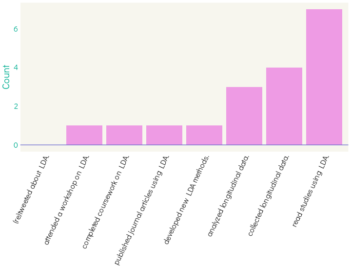

Experience with Specific Techniques
===
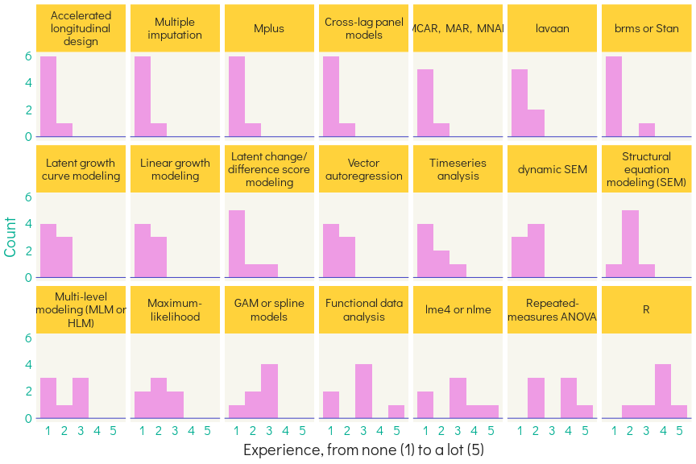

What should I prioritize?
===
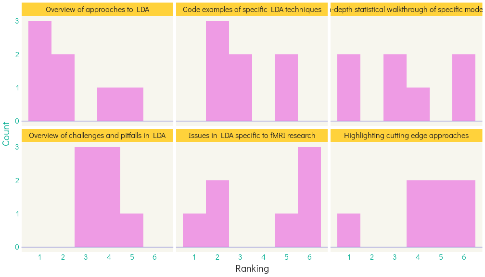

What are you curious to see in code?
===
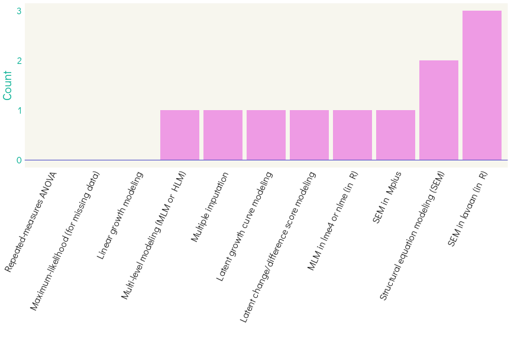

What models are you curious about?
===
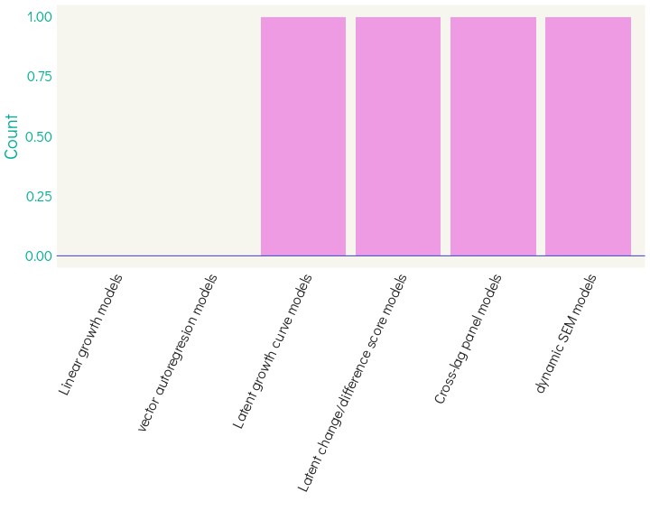

What is longitudinal data?
===
Any data that is collected on the same thing over time.

In psych, we focus on individuals, so usually it's a person measured multiple times.

Many research designs can be considered longitudinal:

- Experiments (within-subjects designs, esp. pre-post treatment)
- A single fMRI scan (multiple whole-brain volumes collected over time)
- Ecological momentary assessment (multiple questionnaires per day)
- **Multiple assessments over intervals of weeks, months, and years**


Why do we care about longitudinal data?
===
Some of us are developmental researchers.

- E.g., we ask basic questions about how people **change over time** normally, and _maybe_ how that accounts for other things we care about.

Some of us are clinical researchers that focus on childhood.

- E.g., we ask questions about how **early experiences change risk for later clinical outcomes**.


Overview of LDA: A roadmap
===
0. <span style='color:gray'>What is it and why do we care?</span>
1. How does longitudinal data improve inference?
3. What kinds of models can you fit (and what data do you need)?
    - Latent growth curve
    - Bivariate latent growth curve
    - (Random-intercept) cross-lag panel model


Longitudinal data improves inference
===
incremental: true
1. _Prospective:_ You observe the construct as it's changing rather than asking for retrospective reports.
2. _Within-person changes:_ Each person is their own "control." 
    - You can be sure that when you observe a change, it is unconfounded by everything that stays the same about a person.
3. _Disaggregate different effects of time:_ Separate the effects of **age**, **cohort/generation**, and **history/period**.
    - In a cross-sectional study, someone's age is perfectly confounded with their generation (every 15 year old right was born around 2005).

Another way to put it: Cross-sectional data require that...
===
incremental: true
1. Phenomena are _ergodic_.
    - The phenomenon shows the same pattern across the group as it does within the individual.
    - E.g., does every individual's developmental trajectory match what you see in a cross-section of a population?
    - **Longitudinal data measures within-person changes.**
2. Individuals must be thought of as _exchangeable_.
    - E.g., is the 17-year-old in your sample essentially the "same person" as the 10-year-old, just 7 years older?
    - **Longitudinal data allow you to know that they are actually the same person.**
    
<small>([**Fisher et al., 2018**](http://www.pnas.org/lookup/doi/10.1073/pnas.1711978115); Molenaar & Campbell, 2009)</small>

Simpson's Paradox
---


Some nice longitudinal designs
===
incremental: true
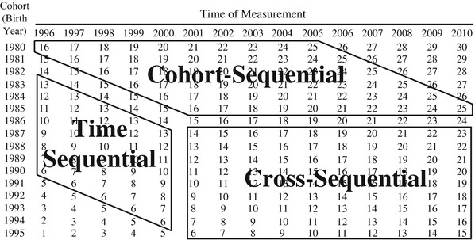

If you care about age effects, these will allow you to keep them free of either cohort, or history confounds.
- But because Age = Period - Cohort you always have to _assume_ that at least one of these is absent (Bell & Jones, 2015).

Beyond Age
===
incremental: true
Do we care about age, _per se_?

Developmentalists care about things for which age is a proxy:
- Biological development (e.g., adren/gonadarche, myelination)
- Social development (e.g., changing social roles, opportunities, expectations, contexts)

Clinically, we may simply be interested in changes that happen during particular developmental windows
- E.g., we care about specific experiences during times when they may have the strongest effect

We will develop our best longitudinal research if we focus on the mechanisms of interest, rather than age.

Overview of LDA: A roadmap
===
0. <span style='color:gray'>What is it and why do we care?</span>
1. <span style='color:gray'>How does longitudinal data improve inference?</span>
3. What kinds of models can you fit (and what data do you need)?
    - Latent growth curve
    - Bivariate latent growth curve
    - (Random-intercept) cross-lag panel model

What kinds of models can you fit?
===
incremental: true
So many kinds of change, and as many models
- Structural change (e.g., structure of psychopathology, resting-state network partitions)
- Rank order: is a person with a higher score than most at time 1 likely to be higher than most at time 2?
- Normative: does the population average change over time (e.g., normative executive functioning increases)?
- Individual: how variable are individual differences in how people deviate from the mean normative trajectory?
- Probably a lot more...

What kinds of models can you fit?
===
So many kinds of change, and as many models
- Structural change (e.g., structure of psychopathology, resting-state network partitions)
- **Rank order**: is a person with a higher score than most at time 1 likely to be higher than most at time 2?
- **Normative**: does the population average change over time (e.g., normative executive functioning increases)?
- **Individual**: how variable are individual differences in how people deviate from the mean normative trajectory?
- Probably a lot more...

Three common, useful SEMs for longitudinal data
===
1. Latent growth curve models
2. (Random-intercept) cross-lag panel models
3. <span style='color:gray'>Latent difference score models</span>

Quick aside for notation:
===
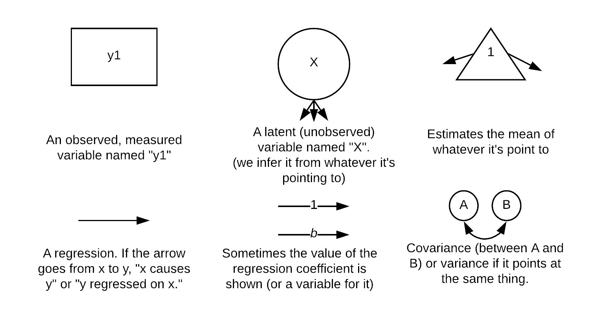

Latent growth curve models
===

Model _normative change_ and _individual change_.
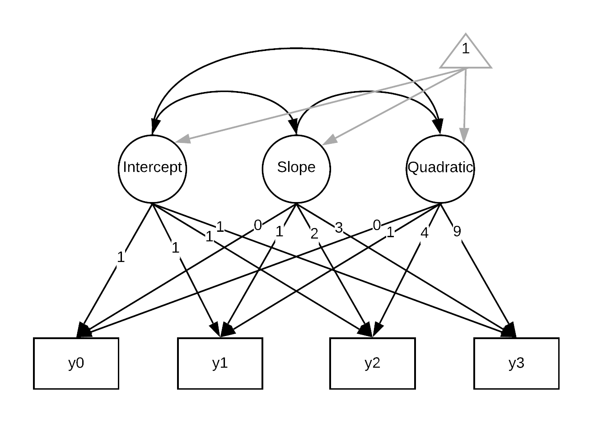

What might data fit by this model look like?
===


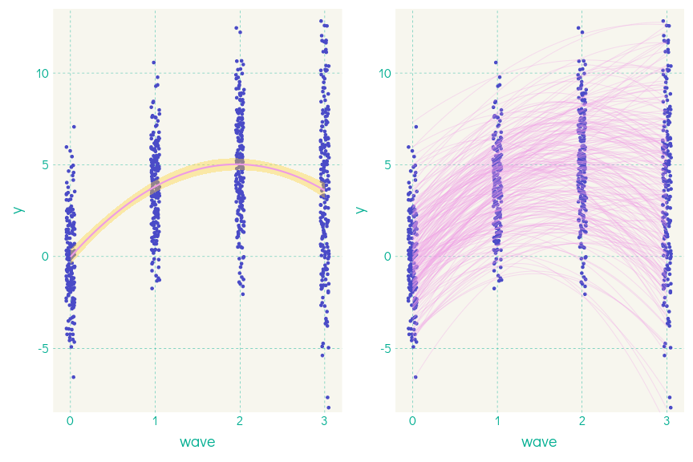

How do we do this in R?
===


```r
library(lavaan)
quad_lgcm <- "
# intercept, slope, quadratic with fixed coefficients
i =~ 1*y0 + 1*y1 + 1*y2 + 1*y3
s =~ 0*y0 + 1*y1 + 2*y2 + 3*y3
q =~ 0*y0 + 1*y1 + 4*y2 + 9*y3
#Estimate the means of each of these terms
i ~ 1
s ~ 1
q ~ 1
#Estimate the covariance between terms
i ~~ s + q
s ~~ q"

quad_lgcm_fit <- lavaan::growth(model = quad_lgcm, data = growth_data)
```

Lavaan-to-model correspondence
===
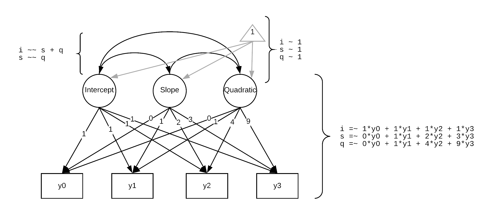

Model summary...
===

```r
summary(quad_lgcm_fit, stan = TRUE)
```

```
lavaan 0.6-5 ended normally after 59 iterations

  Estimator                                         ML
  Optimization method                           NLMINB
  Number of free parameters                         13
                                                      
  Number of observations                           200
                                                      
Model Test User Model:
                                                      
  Test statistic                                 0.004
  Degrees of freedom                                 1
  P-value (Chi-square)                           0.950

Parameter Estimates:

  Information                                 Expected
  Information saturated (h1) model          Structured
  Standard errors                             Standard

Latent Variables:
                   Estimate  Std.Err  z-value  P(>|z|)   Std.lv  Std.all
  i =~                                                                  
    y0                1.000                               2.078    0.889
    y1                1.000                               2.078    0.887
    y2                1.000                               2.078    0.709
    y3                1.000                               2.078    0.472
  s =~                                                                  
    y0                0.000                                 NaN      NaN
    y1                1.000                                 NaN      NaN
    y2                2.000                                 NaN      NaN
    y3                3.000                                 NaN      NaN
  q =~                                                                  
    y0                0.000                               0.000    0.000
    y1                1.000                               0.291    0.124
    y2                4.000                               1.164    0.397
    y3                9.000                               2.620    0.595

Covariances:
                   Estimate  Std.Err  z-value  P(>|z|)   Std.lv  Std.all
  i ~~                                                                  
    s                -0.091    0.816   -0.111    0.912   -0.088   -0.088
    q                 0.074    0.206    0.358    0.721    0.122    0.122
  s ~~                                                                  
    q                 0.165    0.199    0.830    0.407    1.143    1.143

Intercepts:
                   Estimate  Std.Err  z-value  P(>|z|)   Std.lv  Std.all
    i                -0.017    0.164   -0.106    0.916   -0.008   -0.008
    s                 5.151    0.108   47.563    0.000      NaN      NaN
    q                -1.315    0.041  -32.399    0.000   -4.519   -4.519
   .y0                0.000                               0.000    0.000
   .y1                0.000                               0.000    0.000
   .y2                0.000                               0.000    0.000
   .y3                0.000                               0.000    0.000

Variances:
                   Estimate  Std.Err  z-value  P(>|z|)   Std.lv  Std.all
   .y0                1.152    0.752    1.532    0.126    1.152    0.211
   .y1                1.030    0.260    3.963    0.000    1.030    0.188
   .y2                1.033    0.321    3.222    0.001    1.033    0.120
   .y3                0.713    1.408    0.506    0.613    0.713    0.037
    i                 4.319    0.860    5.024    0.000    1.000    1.000
    s                -0.247    0.827   -0.299    0.765      NaN      NaN
    q                 0.085    0.082    1.040    0.298    1.000    1.000
```

What kind of data do you need?
===
incremental: true
For these kinds of growth models you need one more wave than the number of growth parameters.

1. Linear growth curves require 3 waves.
2. Quadratic growth curves require 4 waves.

Why?

Disaggregating true change from sources of error
===
incremental: true
Any two points can be perfectly joined by a line, and any three points can be joined by a quadratic curve.

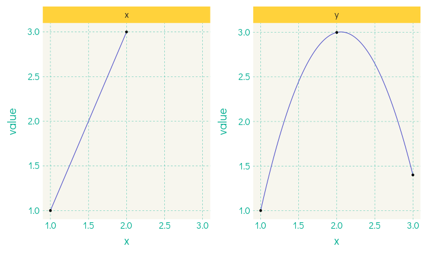

Disaggregating true change from sources of error
===
incremental: true
Why is it bad if that fits perfectly?

Our measures at each wave are the result of _true change_ as well as other influences we're not interested in.

1. Measurement error (e.g., noise in the BOLD signal, mis-answered question)
2. True random state variation (e.g., someone was just having a bad day and was distracted during the EF task)

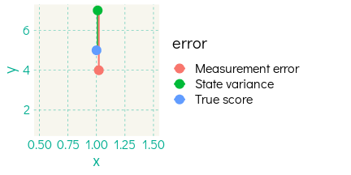

Fitting a model without enough data
===


```r
growth_model_to_est_3wave <- "
					# intercept and slope with fixed coefficients
					i =~ 1*y0 + 1*y1 + 1*y2
					s =~ 0*y0 + 1*y1 + 2*y2
					q =~ 0*y0 + 1*y1 + 4*y2
					# If I don't set this, the model will have -3 df
					y0 ~~ 0*y0
					y1 ~~ 0*y1
					y2 ~~ 0*y2
					"
growth_fit_3wave <- lavaan::growth(model = growth_model_to_est_3wave, data = growth_data)
summary(growth_fit_3wave)
```

```
lavaan 0.6-5 ended normally after 73 iterations

  Estimator                                         ML
  Optimization method                           NLMINB
  Number of free parameters                          9
                                                      
  Number of observations                           200
                                                      
Model Test User Model:
                                                      
  Test statistic                                 0.000
  Degrees of freedom                                 0

Parameter Estimates:

  Information                                 Expected
  Information saturated (h1) model          Structured
  Standard errors                             Standard

Latent Variables:
                   Estimate  Std.Err  z-value  P(>|z|)
  i =~                                                
    y0                1.000                           
    y1                1.000                           
    y2                1.000                           
  s =~                                                
    y0                0.000                           
    y1                1.000                           
    y2                2.000                           
  q =~                                                
    y0                0.000                           
    y1                1.000                           
    y2                4.000                           

Covariances:
                   Estimate  Std.Err  z-value  P(>|z|)
  i ~~                                                
    s                -1.819    0.448   -4.062    0.000
    q                 0.650    0.218    2.980    0.003
  s ~~                                                
    q                -3.017    0.318   -9.477    0.000

Intercepts:
                   Estimate  Std.Err  z-value  P(>|z|)
   .y0                0.000                           
   .y1                0.000                           
   .y2                0.000                           
    i                -0.016    0.165   -0.098    0.922
    s                 5.142    0.183   28.045    0.000
    q                -1.310    0.091  -14.378    0.000

Variances:
                   Estimate  Std.Err  z-value  P(>|z|)
   .y0                0.000                           
   .y1                0.000                           
   .y2                0.000                           
    i                 5.471    0.547   10.000    0.000
    s                 6.723    0.672   10.000    0.000
    q                 1.661    0.166   10.000    0.000
```

Fitting a model without enough data (alternative)
===


```r
growth_model_to_est_3wave <- "
					# intercept and slope with fixed coefficients
					i =~ 1*y0 + 1*y1 + 1*y2
					s =~ 0*y0 + 1*y1 + 2*y2
					q =~ 0*y0 + 1*y1 + 4*y2
					# If I don't set this, the model will have -3 df
					q ~~ 0*q + 0*s + 0*i
					"
growth_fit_3wave <- lavaan::growth(model = growth_model_to_est_3wave, data = growth_data)
summary(growth_fit_3wave)
```

```
lavaan 0.6-5 ended normally after 42 iterations

  Estimator                                         ML
  Optimization method                           NLMINB
  Number of free parameters                          9
                                                      
  Number of observations                           200
                                                      
Model Test User Model:
                                                      
  Test statistic                                 0.000
  Degrees of freedom                                 0

Parameter Estimates:

  Information                                 Expected
  Information saturated (h1) model          Structured
  Standard errors                             Standard

Latent Variables:
                   Estimate  Std.Err  z-value  P(>|z|)
  i =~                                                
    y0                1.000                           
    y1                1.000                           
    y2                1.000                           
  s =~                                                
    y0                0.000                           
    y1                1.000                           
    y2                2.000                           
  q =~                                                
    y0                0.000                           
    y1                1.000                           
    y2                4.000                           

Covariances:
                   Estimate  Std.Err  z-value  P(>|z|)
  s ~~                                                
    q                 0.000                           
  i ~~                                                
    q                 0.000                           
    s                 0.131    0.313    0.418    0.676

Intercepts:
                   Estimate  Std.Err  z-value  P(>|z|)
   .y0                0.000                           
   .y1                0.000                           
   .y2                0.000                           
    i                -0.016    0.165   -0.098    0.922
    s                 5.142    0.183   28.045    0.000
    q                -1.310    0.091  -14.378    0.000

Variances:
                   Estimate  Std.Err  z-value  P(>|z|)
    q                 0.000                           
   .y0                1.299    0.436    2.980    0.003
   .y1                0.706    0.219    3.222    0.001
   .y2                2.520    0.563    4.474    0.000
    i                 4.172    0.589    7.078    0.000
    s                 0.345    0.254    1.360    0.174
```

See the difference in predictions
===
4 wave model:

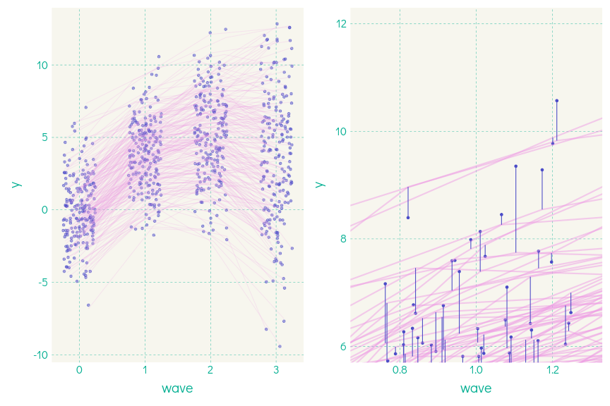

Perfect fit
===
3 Waves:

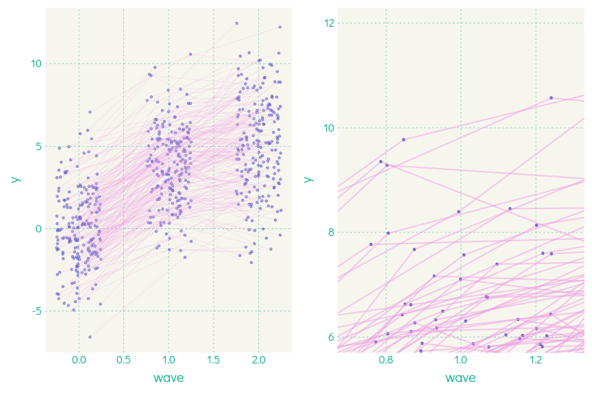

Other data solutions
===
Accelerated longitudinal designs can help with this.
- collect fewer waves per person
- but lose ability to estimate complex individual trajectories (ergodicity problem)


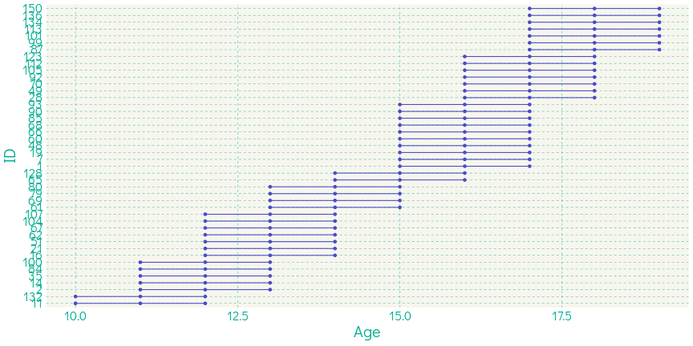

Growth curve in accelerated design
===
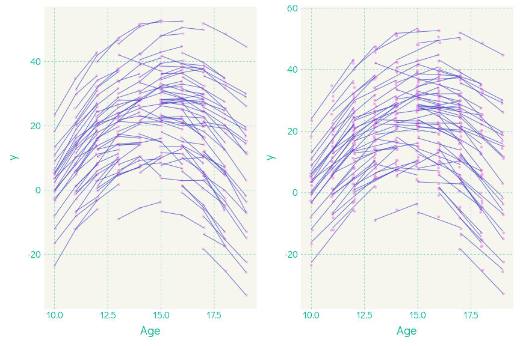

Estimating the model
===
I'll use some `paste` magic to build the full model


```r
ald_lgcm <- paste0("
# intercept slope and quadratic with fixed coefficients",
paste0('\ni =~ ', paste(paste0(lin_weight*0+1, '*y', 0:stop), collapse = ' + ')),
paste0('\ns =~ ', paste(paste0(lin_weight, '*y', 0:stop), collapse = ' + ')),
paste0('\nq =~ ', paste(paste0(lin_weight^2, '*y', 0:stop), collapse = ' + ')))
cat(ald_lgcm)
```

```

# intercept slope and quadratic with fixed coefficients
i =~ 1*y0 + 1*y1 + 1*y2 + 1*y3 + 1*y4 + 1*y5 + 1*y6 + 1*y7 + 1*y8 + 1*y9
s =~ 0*y0 + 1*y1 + 2*y2 + 3*y3 + 4*y4 + 5*y5 + 6*y6 + 7*y7 + 8*y8 + 9*y9
q =~ 0*y0 + 1*y1 + 4*y2 + 9*y3 + 16*y4 + 25*y5 + 36*y6 + 49*y7 + 64*y8 + 81*y9
```

```r
ald_lgcm_fit <- lavaan::growth(model = ald_lgcm, data = ald_growth_data)
summary(ald_lgcm_fit)
```

```
lavaan 0.6-5 ended normally after 182 iterations

  Estimator                                         ML
  Optimization method                           NLMINB
  Number of free parameters                         19
                                                      
  Number of observations                           150
                                                      
Model Test User Model:
                                                      
  Test statistic                                39.949
  Degrees of freedom                                46
  P-value (Chi-square)                           0.723

Parameter Estimates:

  Information                                 Expected
  Information saturated (h1) model          Structured
  Standard errors                             Standard

Latent Variables:
                   Estimate  Std.Err  z-value  P(>|z|)
  i =~                                                
    y0                1.000                           
    y1                1.000                           
    y2                1.000                           
    y3                1.000                           
    y4                1.000                           
    y5                1.000                           
    y6                1.000                           
    y7                1.000                           
    y8                1.000                           
    y9                1.000                           
  s =~                                                
    y0                0.000                           
    y1                1.000                           
    y2                2.000                           
    y3                3.000                           
    y4                4.000                           
    y5                5.000                           
    y6                6.000                           
    y7                7.000                           
    y8                8.000                           
    y9                9.000                           
  q =~                                                
    y0                0.000                           
    y1                1.000                           
    y2                4.000                           
    y3                9.000                           
    y4               16.000                           
    y5               25.000                           
    y6               36.000                           
    y7               49.000                           
    y8               64.000                           
    y9               81.000                           

Covariances:
                   Estimate  Std.Err  z-value  P(>|z|)
  i ~~                                                
    s                -0.561    0.840   -0.668    0.504
    q                 0.151    0.178    0.845    0.398
  s ~~                                                
    q                 0.008    0.012    0.682    0.495

Intercepts:
                   Estimate  Std.Err  z-value  P(>|z|)
   .y0                0.000                           
   .y1                0.000                           
   .y2                0.000                           
   .y3                0.000                           
   .y4                0.000                           
   .y5                0.000                           
   .y6                0.000                           
   .y7                0.000                           
   .y8                0.000                           
   .y9                0.000                           
    i                -0.216    0.995   -0.217    0.828
    s                 9.994    0.069  145.726    0.000
    q                -0.997    0.015  -68.390    0.000

Variances:
                   Estimate  Std.Err  z-value  P(>|z|)
   .y0                0.957    0.259    3.688    0.000
   .y1                1.086    0.174    6.230    0.000
   .y2                1.145    0.159    7.212    0.000
   .y3                0.854    0.126    6.766    0.000
   .y4                1.006    0.144    6.980    0.000
   .y5                0.994    0.141    7.048    0.000
   .y6                0.943    0.132    7.139    0.000
   .y7                0.859    0.127    6.776    0.000
   .y8                0.808    0.167    4.851    0.000
   .y9                1.679    0.355    4.725    0.000
    i               147.965   17.158    8.624    0.000
    s                 0.533    0.084    6.354    0.000
    q                 0.030    0.004    8.082    0.000
```

Overview of LDA: A roadmap
===
0. <span style='color:gray'>What is it and why do we care?</span>
1. <span style='color:gray'>How does longitudinal data improve inference?</span>
3. <span style='color:gray'>What kinds of models can you fit (and what data do you need)?</span>
    - <span style='color:gray'>Latent growth curve</span>
    - Bivariate latent growth curve
    - (Random-intercept) cross-lag panel model
    
Bivariate LGC model
===
incremental: true
The latent intercept, slope, and quadratic term are variables!

You can use them in regression and covariance equations!

Use a person's intercept or slope to predict some other outcome!

See what predicts steeper increases!

Examine correlated slopes!

Bivariate LGC in lavaan
===

```r
quad_bivar_lgcm <- "
# Y intercept, slope, quadratic
Y_i =~ 1*y0 + 1*y1 + 1*y2 + 1*y3
Y_s =~ 0*y0 + 1*y1 + 2*y2 + 3*y3
Y_q =~ 0*y0 + 1*y1 + 4*y2 + 9*y3

# X intercept, slope, quadratic
X_i =~ 1*x0 + 1*x1 + 1*x2 + 1*x3
X_s =~ 0*x0 + 1*x1 + 2*x2 + 3*x3
X_q =~ 0*x0 + 1*x1 + 4*x2 + 9*x3

#Correlations between parameters of X and Y
Y_i ~~ Xi + X_s + Xq
Y_s ~~ Xi + X_s + Xq
Y_q ~~ Xi + X_s + Xq

#Test effect of individual-difference measure Z (e.g. SES)
Y_i ~ Z #is the Y intercept predicted by Z?
Y_s ~ Z
Y_q ~ Z
X_i ~ Z
X_s ~ Z
X_q ~ Z"
```

Other kinds of growth models
===
Similar to the above...
- Non-parametric "free curve" (e.g., [Wood & Jackson, 2013](https://dx.doi.org/10.1017/S095457941300014X))
- Latent difference score ([Kievit et al., 2018](http://www.sciencedirect.com/science/article/pii/S187892931730021X), [McArdle, 2009](http://dx.doi.org/10.1146/annurev.psych.60.110707.163612)) 
- Dynamic SEM ([Grimm & Ram, 2018](https://doi.org/10.1146/annurev-clinpsy-050817-084840), [Hamaker et al., 2018](https://doi.org/10.1080/00273171.2018.1446819); [McNeish, 2018](https://psyarxiv.com/j56bm/))

Overview of LDA: A roadmap
===
0. <span style='color:gray'>What is it and why do we care?</span>
1. <span style='color:gray'>How does longitudinal data improve inference?</span>
3. <span style='color:gray'>What kinds of models can you fit (and what data do you need)?</span>
    - <span style='color:gray'>Latent growth curve</span>
    - <span style='color:gray'>Bivariate latent growth curve</span>
    - (Random-intercept) cross-lag panel model
    
Cross-lag panel model
===
What if you don't really care about the shape of change?

You primarily care about how within-person changes in one variable are related to within-person changes in another variable...

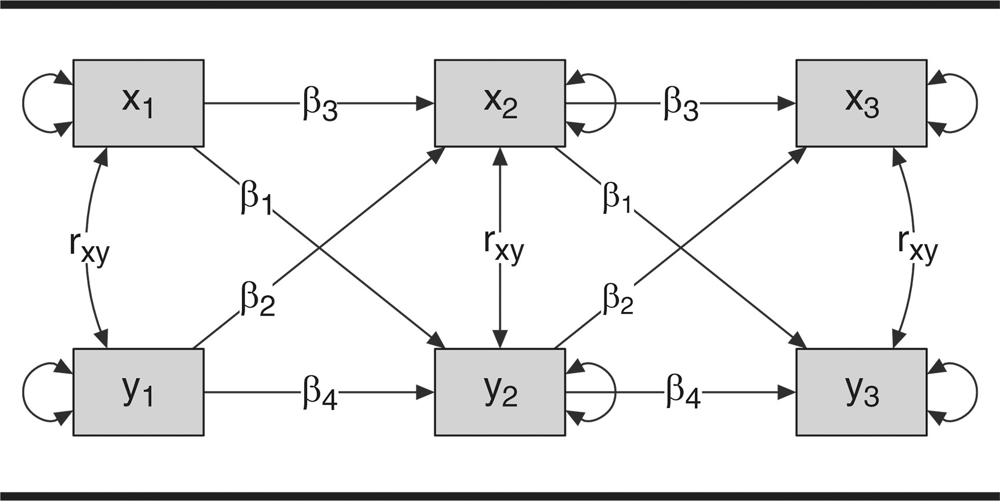

Cross-lag panel model
===


Looks awesome. Seems to answer the question, "how does the previous score on Y predict the next score on X, over and above the previous level of X."

"A Critique of the Cross-Lagged Panel Model"
===

The traditional CLPM does not distinguish between-person variance from within-person variance.

We can add a latent (aka "random") intercept (or even intercept and slope) to pull out the stable, between-person variance.

<small>([Hamaker et al., 2015](https://doi.org/10.1037/a0038889))</small>

Random-intercept CLPM
===

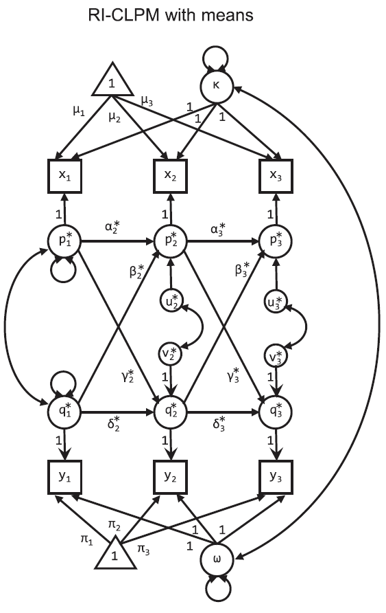

Random-intercept CLPM
===

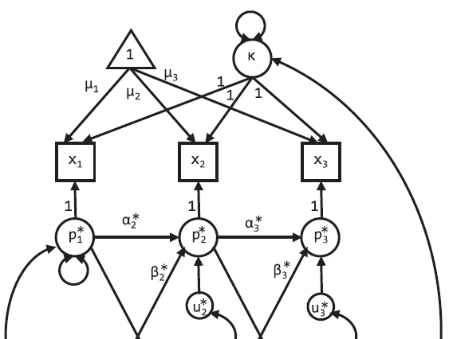

The observed score is caused by the group mean (triangle), the individually-varying (random) intercept $\kappa$, and the latent residual, $p$.

The trick is to use the latent residuals for the CLPM, so now $\alpha$ and $\beta$ encode associations of within-person variance.

RI-CLPM in lavaan
===


```r
riclpmModel <- 
'
#Note, the data contain x1-3 and y1-3
#Latent mean Structure with intercepts

kappa =~ 1*x1 + 1*x2 + 1*x3
omega =~ 1*y1 + 1*y2 + 1*y3

x1 ~ mu1*1 #ov intercepts
x2 ~ mu2*1
x3 ~ mu3*1
y1 ~ pi1*1
y2 ~ pi2*1
y3 ~ pi3*1

kappa ~~ kappa #variance
omega ~~ omega #variance
kappa ~~ omega #covariance

#laten vars for AR and cross-lagged effects
p1 =~ 1*x1 #each factor loading set to 1
p2 =~ 1*x2
p3 =~ 1*x3
q1 =~ 1*y1
q2 =~ 1*y2
q3 =~ 1*y3

#Later, we may constrain autoregression and cross-lagged
#effects to be the same across both lags.
p3 ~ alpha3*p2 + beta3*q2
p2 ~ alpha2*p1 + beta2*q1

q3 ~ delta3*q2 + gamma3*p2
q2 ~ delta2*q1 + gamma2*p1

p1 ~~ p1 #variance
p2 ~~ u2*p2
p3 ~~ u3*p3
q1 ~~ q1 #variance
q2 ~~ v2*q2
q3 ~~ v3*q3

p1 ~~ q1 #p1 and q1 covariance
p2 ~~ q2 #p2 and q2 covariance
p3 ~~ q3 #p2 and q2 covariance'
```

Fitting it in lavaan
===


```r
fit <- lavaan(riclpmModel, data = antiread,
              missing = 'ML', #for the missing data!
              int.ov.free = F,
              int.lv.free = F,
              auto.fix.first = F,
              auto.fix.single = F,
              auto.cov.lv.x = F,
              auto.cov.y = F,
              auto.var = F)
```

There's a package
===

Very simple package, very much an alpha version: https://jflournoy.github.io/riclpmr/

It will generate the correct model syntax if you give it sets of variable names, and estimate it using the correct options in lavaan.


```r
var_groups <- list(
    x=c("x_t1",  "x_t2",  "x_t3"),
    y=c("y_t1",  "y_t2",  "y_t3"),
    z=c("z_t1",  "z_t2",  "z_t3"))
model_text <- riclpmr::riclpm_text(var_groups)
fit <- riclpmr::lavriclpm(model_text, data = d)
```

